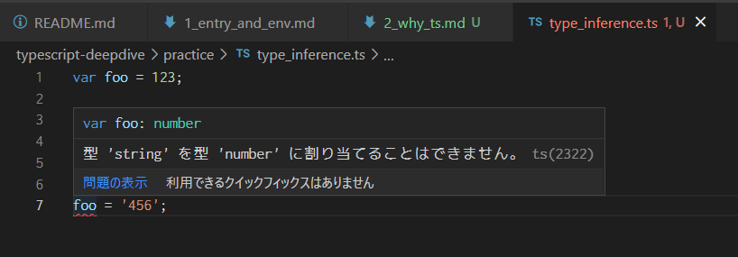

# なぜTypeScriptを使うのか

## 1. 開発スピードの上昇

型を導入することでコンパイルという早めの段階でエラーを見つけることができる
コードを作って実際に動作させるよりも、コードを書いてる時点でエラーに気づければ、
修正もすぐにできるので、開発スピードが上がる

## 2. 型導入の障壁が少ない

- jsファイルはtsファイル

.jsのファイルを.tsに変えてコンパイルしても問題なく動く
そもそも型を導入するかどうかは開発者の意図にゆだねられている

- 暗黙的な方推論機能がある



```ts
var foo = 123;
foo = '456';

// 型 'string' を型 'number' に割り当てることはできません
```

- 明示的な型指定

```ts
var foo: number = 123;

var foo: number = '123';
// 型 'string' を型 'number' に割り当てることはできません
```

明示的な型指定を行うことで、
将来の開発者(もしくは未来の自分)にとってわかりやすいコードになる

また、開発者の理解とコンパイラの型チェックの理解を一致させることで
開発者の思う正しいアルゴリズムにコンパイラを強制できる

- 構造的な型